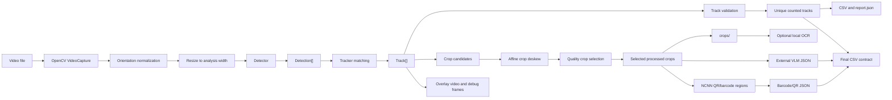

# Архитектура Price Tag Pipeline

Документ описывает текущую архитектуру MVP для детекции, трекинга и подсчета уникальных ценников на видео. Главный принцип: detector, tracker и OCR должны быть независимыми слоями с простыми контрактами, чтобы можно было менять модель детекции или добавлять OCR без переписывания пайплайна.

## Цель пайплайна

На вход подается видео прохода камеры вдоль полки. В нормализованной ориентации ценники движутся слева направо. Нужно получить список уникальных ценников, координаты и кадры их появления, лучший кроп для последующего OCR и диагностические артефакты для проверки качества.

## Компоненты

```text
price_tag_pipeline/run_pipeline.py
  Точка входа. Парсит CLI и запускает core.pipeline.run_pipeline().

price_tag_pipeline/core/
  cli.py             CLI-параметры и дефолты
  pipeline.py        основной цикл обработки видео
  image.py           resize, rotate, crop, цветовые признаки
  geometry.py        bbox-утилиты, IoU, NMS, масштабирование
  output.py          запись CSV по трекам и истории
  visualization.py   overlay-разметка для видео и debug-кадров

price_tag_pipeline/detector/
  types.py           dataclass Detection
  factory.py         выбор detector по CLI
  onnx_yolo.py       ONNX YOLO11x detector
  heuristic.py       fallback detector по красным областям

price_tag_pipeline/tracker/
  models.py          Observation и Track
  tracker.py         matching, валидация треков, логика подсчета

price_tag_pipeline/ocr/
  extractor.py       будущий OCR-контракт

price_tag_pipeline/vlm/
  client.py          будущий клиент внешнего VLM-сервиса

price_tag_pipeline/codes/
  detector.py        NCNN detector QR/barcode зон внутри кропа ценника
  reader.py          barcode/QR-code decoding и нормализация QR payload

price_tag_pipeline/sources/
  video.py           вспомогательная логика для видеоисточников
```

## Поток данных



## Механика пайплайна

Целевая механика обработки:

1. `main` запускает механизм обработки видео.
2. Параметры передаются вместе с запуском через CLI.
3. Детектор находит ценники на кадрах.
4. Трекер связывает задетектированные объекты между кадрами, чтобы убрать дубли в движении.
5. Для каждого уникального трека выбираются crop-кандидаты.
6. Crop-кандидаты выпрямляются аффинным преобразованием.
7. Quality-классификатор проверяет, нужно ли сохранять конкретный кроп. Это бинарный классификатор, который получает ч/б вход; сам финальный кроп не преобразуется в ч/б.
8. Обработанные выбранные кропы по одному отправляются во внешний VLM-сервис по адресу сервиса. VLM возвращает JSON с информацией о ценнике: наименование, цена, скидки и другие поля.
9. После VLM на тех же кропах работает NCNN-детектор QR/barcode зон, найденные зоны сохраняются в `code_crops/` и передаются в barcode/QR-code reader.
10. После этого формируется финальный CSV. Схема финального CSV будет задана отдельно.

## Основной цикл

`core.pipeline.run_pipeline()` выполняет следующие шаги:

1. Создает `--out-dir`, `crops/` и `overlays/`.
2. Открывает видео через `cv2.VideoCapture`.
3. Создает detector через `detector.factory.build_detector()`.
4. Для каждого выбранного кадра:
   - нормализует ориентацию;
   - приводит кадр к `--width`;
   - получает список `Detection`;
   - обновляет активные треки;
   - считает валидные уникальные треки;
   - пишет строки статистики по кадру;
   - добавляет кадр в overlay-видео;
   - сохраняет debug overlay для выбранных кадров.
5. После прохода по видео:
   - объединяет завершенные и активные треки;
   - фильтрует валидные треки;
   - выпрямляет crop-кандидаты аффинным преобразованием;
   - выбирает финальный crop-кандидат через quality-логику, если она подключена;
   - сохраняет лучшие кропы;
   - пишет промежуточные CSV и `report.json`.

VLM, barcode/QR и финальный CSV подключены отдельными слоями контрактов. OCR/VLM работает через OpenAI-compatible endpoint, поэтому один и тот же pipeline можно запускать с LM Studio, удаленным сервисом или llama.cpp в Docker.

## Контракт детектора

Любой detector должен иметь метод:

```python
def predict(self, frame: np.ndarray) -> list[Detection]:
    ...
```

`frame` - уже нормализованный и уменьшенный кадр анализа.

`Detection` содержит:

```text
bbox                 bbox всего ценника в координатах analysis-frame
red_bbox             bbox красной зоны, если она известна
score                confidence детектора
white_ratio          доля белых пикселей в кропе
upper_white_ratio    доля белых пикселей в верхней части кропа
red_ratio            доля красных пикселей
```

ONNX-детектор:

- делает letterbox до `--onnx-input-size`;
- запускает `onnxruntime`;
- интерпретирует выход как `cx, cy, w, h, confidence`;
- делает обратное масштабирование bbox;
- применяет NMS;
- досчитывает простые цветовые признаки для фильтрации треков.

Эвристический detector:

- ищет красные области;
- расширяет красный bbox до предполагаемого bbox ценника;
- фильтрует кандидаты по aspect ratio, белой зоне и красной зоне.

## Контракт трекера

Трек состоит из `Observation[]`.

`Observation` фиксирует состояние bbox на конкретном кадре:

```text
frame
time_sec
bbox
red_bbox
score
white_ratio
upper_white_ratio
red_ratio
sharpness
crop_quality
```

`Track` хранит:

```text
track_id
observations
missed
counted_frame
counted_time_sec
crop_candidates
best_observation
best_crop
best_crop_bbox_full
selected_crop_rank
selected_quality_label
selected_quality_score
selected_quality_passed
```

Matching в `tracker.assign_detections()` строится по центрам bbox и штрафам:

- расстояние между центрами;
- изменение площади bbox;
- движение назад по X;
- вертикальный скачок;
- изменение ширины.

Связка запрещается, если:

- детекция ушла назад сильнее `--max-backward-step`;
- скачок по Y больше допустимого порога;
- расстояние больше `--max-link-distance`.

## Правый край кадра

Для текущих видео важна защита от identity switch справа. Когда ценник уходит за правый край, его bbox может частично оставаться в кадре и начать связываться с соседними ценниками.

Для этого есть два параметра:

```text
--right-edge-retire-ratio   завершает трек около правого края
--right-edge-ignore-ratio   исключает слишком правые детекции из matching
```

Это удерживает трек от перехвата другого объекта, когда исходный ценник уже почти вышел из кадра.

## Режимы подсчета

### seen

Основной режим по умолчанию.

```text
--count-mode seen
```

Каждый валидный трек считается уникальным ценником. Линия пересечения не используется. Этот режим подходит для задачи "посчитать все уникальные ценники, которые были видны в кадрах".

### line

Экспериментальный режим.

```text
--count-mode line
```

Трек считается только при пересечении вертикальной линии `--crossing-x-ratio`. Режим оставлен для сравнений, но текущая задача лучше ложится на `seen`.

## Валидация трека

Трек считается валидным, если выполняются условия:

- длина не меньше `--min-track-frames`;
- суммарное движение по X не меньше `--min-delta-x`;
- если явно задан `--max-track-height > 0`, высота лучшего bbox не больше этого значения;
- aspect ratio лучшего bbox не меньше `--min-track-aspect`;
- медианная белая зона выше `--min-track-white-ratio`;
- медианная верхняя белая зона выше `--min-track-white-ratio`;
- медианная красная зона не слишком большая.

Эта фильтрация отсекает короткие ложные срабатывания, фрагменты упаковок и нестабильные bbox. Жесткий cap по высоте bbox по умолчанию выключен, потому что для ONNX-детектора это дублирует ответственность модели и может отбрасывать валидные ценники другого масштаба.

## Выбор лучшего кропа

Для каждого трека хранится несколько лучших crop-кандидатов по `crop_quality`. Количество кандидатов ограничивается параметром `--max-crop-candidates`, дефолт `24`.

Сейчас качество складывается из:

- confidence детектора;
- резкости кропа;
- близости к центру кадра;
- площади bbox.

Перед quality-selection каждый crop-кандидат проходит через optional deskew. Deskew включен по умолчанию и делает только аффинный поворот кропа, не меняя трекинговые bbox.

Оценка угла:

- основной метод: красная область ценника через `red_mask` и `minAreaRect`;
- fallback: длинные почти горизонтальные линии через Hough.

Если угол меньше `--crop-deskew-min-angle`, больше `--crop-deskew-max-angle` или confidence ниже `--crop-deskew-min-confidence`, кроп остается исходным. Отключить шаг можно через `--no-deskew-crops`.

Если quality-классификатор не подключен, финальным кропом остается лучший выпрямленный кандидат по `crop_quality`.

Если подключен бинарный ONNX или NPZ-классификатор качества, финальный выбор происходит так:

1. Кандидаты внутри трека сортируются по `crop_quality`.
2. Для модели каждый кандидат преобразуется в ч/б tensor, по умолчанию `--quality-input-mode grayscale`. Для локальной `models/lenta_quality_cnn.npz` параметры `image_size`, `input_mode`, `downsample_factor` и `decision_threshold` читаются из файла модели.
3. Сам сохраненный кроп не преобразуется в ч/б; grayscale используется только как вход quality-модели.
4. Модель проверяет кандидаты по очереди.
5. Первый кандидат с pass-классом `--quality-pass-class`, по умолчанию `1`, становится финальным кропом и сохраняется в `crops/`.
6. Если все кандидаты получили class `0`, лучший fallback-кандидат остается выбранным для диагностических полей CSV, но файл в `crops/` не сохраняется. В CSV такие строки имеют `quality_passed=0`, `crop_saved=0` и пустой `crop_path`.

Это нужно, чтобы OCR в будущем получал не первый попавшийся bbox и не просто самый резкий по эвристике, а кадр, прошедший модельную проверку качества.

## Выходные данные

```text
report.json
  Сводка запуска, параметры, количество треков и пути к артефактам.

unique_price_tags.csv
  Основной результат. Один ряд на уникальный посчитанный ценник, включая поля quality-selection.
  Также содержит поля deskew_applied, deskew_angle, deskew_confidence и deskew_method.

all_valid_tracks.csv
  Все валидные треки, включая не посчитанные в line-режиме.

track_history.csv
  Полная история bbox каждого трека.

frame_counts.csv
  Статистика по кадрам: число детекций, активных треков и cumulative count.

detections.csv
  Сырые детекции detector до трекинга.

structured_price_tags.csv
  Финальный структурированный CSV после OCR/QR, если запуск был с `--run-ocr`.

ocr_raw_responses.jsonl
  Сырые ответы OCR-модели, ошибки и debug-информация по QR, если запуск был с `--run-ocr`.

crops/
  Сохраненные финальные кропы. Если quality-классификатор включен, здесь лежат только кропы с `quality_passed=1`.

overlays/
  Debug-кадры с bbox и track_id.

counting_overlay.mp4
  Видео для визуальной проверки трекинга и подсчета.
```

## LM Studio OCR-слой

OCR подключен как optional stage после завершения трекинга и сохранения quality-passed кропов. Он включается флагом `--run-ocr` и ходит в OpenAI-compatible endpoint локального LM Studio.
Для Nemotron в LM Studio reasoning выключен через local `model.yaml` (`enableThinking.defaultValue=false`); pipeline дополнительно отправляет `/no_think` и `chat_template_kwargs.enable_thinking=false`.

Точка интеграции:

```text
price_tag_pipeline/ocr/extractor.py
price_tag_pipeline/ocr/stage.py
```

Вход:

```text
unique_price_tags.csv rows with crop_saved=1 + crops/
optional fallback crops for quality-failed tracks, если включен --ocr-include-quality-failed
```

Выход:

```text
structured_price_tags.csv
ocr_raw_responses.jsonl
```

OCR-промпт требует JSON с полями:

```text
product_name
price_default
price_card
price_discount
barcode
discount_amount
id_sku
print_datetime
code
additional_info
color
special_symbols
wholesale_level_1_count
wholesale_level_1_price
wholesale_level_2_count
wholesale_level_2_price
```

Prompt опирается на зоны из материалов по расшифровке ценников: `price_default` под QR-кодом и над ценой по карте, `id_sku` под процентной плашкой или в нижней зоне, `print_datetime`, цифры под линейным штрихкодом, символ выкладки `Ш`/`Л`/`К`, доп. инфо вроде `номер на весах`, `Удачная упаковка` или `Сухое`, а также явные оптовые пороги `от N шт`. Поле `code` заполняется только если виден отдельный код выкладки; цену без карты и `id_sku` туда писать нельзя. VLM не должен пытаться декодировать QR по изображению: QR разбирает отдельный модуль.

Перед записью финального CSV значения нормализуются в `price_tag_pipeline/ocr/schema.py`, потому что VLM может вернуть число вместо строки, валюту рядом с ценой, точку вместо запятой или пустое значение вместо `нет`. Нормализатор приводит основные цены к `123,45`, QR-цены к `123.45`, цены вида `55 39` к `55,39`, barcode/SKU к цифрам, скидку к `-23%` или `-50 руб`, символ выкладки к `Ш`/`Л`/`К`, timestamp к integer-строке и сохраняет порядок/заголовки эталонного CSV. Если VLM ошибочно положила цену без карты в `code`, а `price_default` пустой, значение переносится в `price_default`, а `code` очищается.

Если QR не прочитан, CSV-конструктор заполняет безопасные fallback-поля из видимого OCR: `qr_code_barcode` из barcode, `price1_qr` из цены без карты, `price4_qr` из цены по карте, `wholesale_level_*` из явно прочитанных оптовых порогов. Поля `price2_qr`, `price3_qr`, `action_price_qr` и `action_code_qr` не угадываются.

Перед отправкой в VLM кроп может пройти OCR-specific препроцессинг. Режим `vlm-board` строит composite-изображение из полного цветного ценника и увеличенных контрастных нижних зон. Это сохраняет цветовую информацию для поля `color`, но дает модели более читаемый фрагмент с `id_sku`, датой печати, кодом зоны, символами и доп. инфо. Режимы `none`, `grayscale`, `clahe` и `vlm-board` оставлены для A/B-проверки; текущий дефолт `none`, потому что composite-режим на локальной VLM иногда портит основные поля.

`unique_price_tags.csv` хранит две системы координат: `best_full_*` в пикселях нормализованного полного кадра и `source_x_min/source_y_min/source_x_max/source_y_max` в пикселях исходного видео. В `structured_price_tags.csv` поля `x_min`, `y_min`, `x_max`, `y_max` берутся из source-координат, чтобы совпадать с исходным видео и эталонной разметкой. `frame_timestamp` считается по `best_frame / fps` и пишется в миллисекундах от начала видео.

## Barcode/QR-code слой

Barcode и QR-code распознавание выделено в отдельный модуль:

```text
price_tag_pipeline/codes/
```

После VLM на тех же кропах работает NCNN-детектор из `models/qr_detector`. Он находит QR/barcode зоны внутри ценника, сохраняет подготовленные region crops в `code_crops/`, и уже эти изображения уходят в `codes/reader.py`. По умолчанию классы NCNN маппятся в decoder-роли как `0=qr,1=barcode,2=matrix`; `matrix` считается 2D-кодом и записывается в те же QR-поля. Если region detector недоступен или не дал читаемый результат, по умолчанию выполняется старый fallback scan всего OCR-кропа.

Reader выбирает порядок decoder-ов по роли региона: QR/matrix сначала 2D decoder, barcode сначала линейный decoder. Используются `pyzbar`/`zxingcpp`, если они доступны, OpenCV `QRCodeDetector` для QR и OpenCV `barcode_BarcodeDetector` для линейных barcode. Результат объединяется в `structured_price_tags.csv`, а debug-метки источника распознавания сохраняются в `ocr_raw_responses.jsonl`.

QR-поля:

```text
qr_code_barcode
price1_qr
price2_qr
price3_qr
price4_qr
wholesale_level_1_coun
wholesale_level_1_price
wholesale_level_2_count
wholesale_level_2_price
action_price_qr
action_code_qr
```

Поддержанные alias из QR:

```text
barcode/b
price1/p1
price2/p2
price3/p3
price4/p4
wholesaleLevel1Count/wL1C
wholesaleLevel1Price/wL1P
wholesaleLevel2Count/wL2C
wholesaleLevel2Price/wL2P
actionPrice/aP
actionCode/aC
```

## Точки расширения

Новый detector:

1. Создать класс с методом `predict(frame) -> list[Detection]`.
2. Добавить выбор в `detector/factory.py`.
3. Добавить CLI-параметры в `core/cli.py`, если нужны.

Новый OCR:

1. Расширить prompt/нормализацию в `ocr/extractor.py`.
2. Расширить финальный CSV mapper в `ocr/stage.py`.
3. Сохранять raw JSONL для аудита ошибок модели.

Новый VLM client:

1. Реализовать `price_tag_pipeline/vlm/client.py`.
2. Добавить CLI-параметры адреса сервиса, timeout и режима отправки изображения.
3. Сохранять JSON-ответы отдельно, пока не утверждена схема финального CSV.

Новый barcode/QR-code reader:

1. Реализовать `price_tag_pipeline/codes/reader.py`.
2. При необходимости добавить full-frame режим, сейчас используется selected crops.
3. Сохранить результат в отдельный CSV, связав его с `track_id`, если код найден на кропе ценника.

Финальная CSV-сборка:

1. Схема полей зафиксирована в `ocr/stage.py`.
2. Объединяются данные трекинга, OCR JSON и QR JSON.
3. Финальный CSV сохраняется отдельным артефактом `structured_price_tags.csv`.

Новый источник кадров:

1. Добавить модуль в `sources/`.
2. Сохранить контракт: отдавать кадры OpenCV `np.ndarray` и исходный индекс/время.

## Текущие ограничения

- Нет `requirements.txt` или packaging-слоя.
- OCR зависит от запущенного локального LM Studio/OpenAI-compatible сервера.
- Параметры запуска пока передаются через CLI, отдельного config-файла нет.
- ONNX inference сейчас работает через CPUExecutionProvider.
- Нет автоматической оценки качества по размеченному датасету.
- В `Данные/` и `output/` лежат экспериментальные артефакты, которые лучше отделить от кода перед оформлением репозитория.

## Ближайшие инженерные шаги

1. Добавить `requirements.txt`.
2. Вынести параметры запуска в YAML/JSON config.
3. Добавить batch-run по нескольким видео.
4. Прогнать OCR-слой на нескольких видео и оценить точность JSON-полей.
5. Добавить evaluation script против размеченных CSV.
6. Добавить тесты на geometry, NMS, validation и right-edge behavior.
